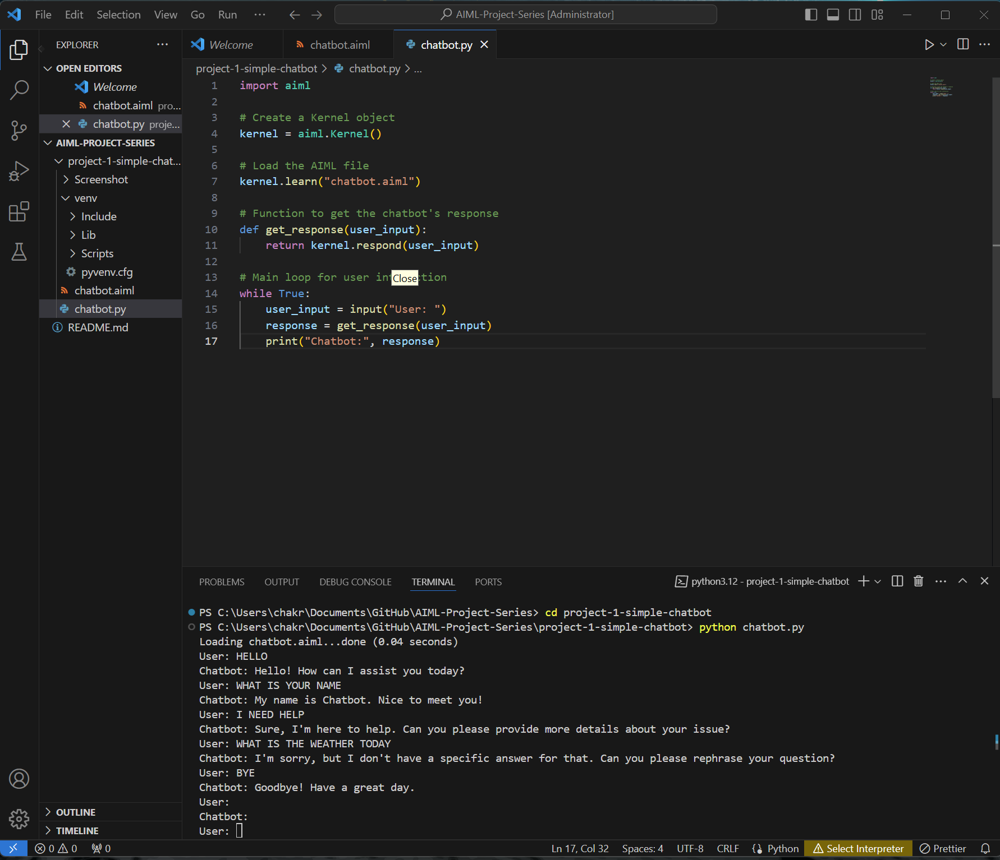
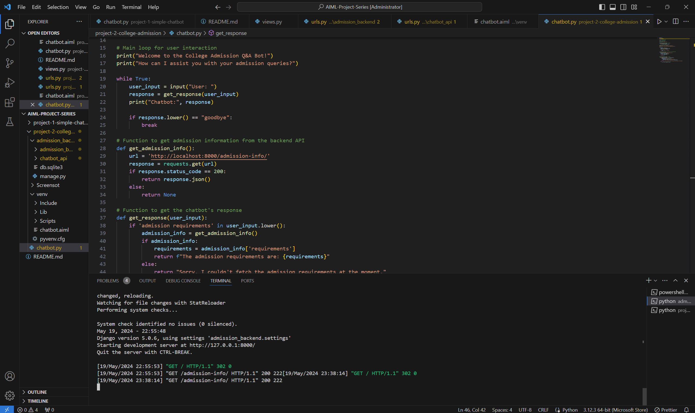
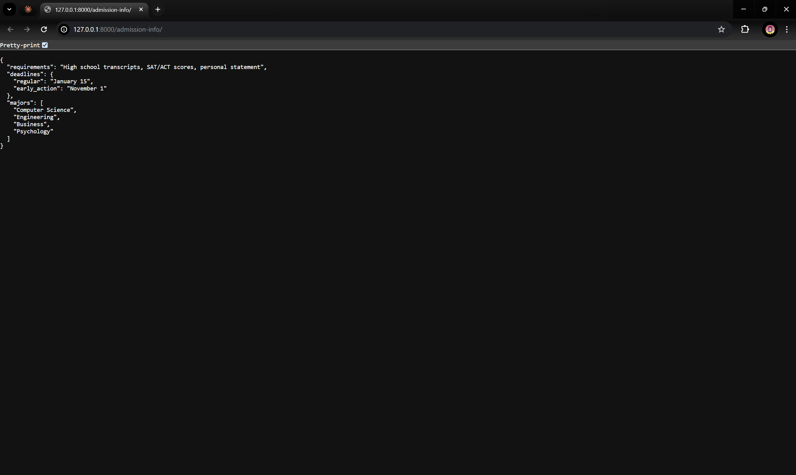

# AIML-Project-Series

# Simple Chatbot (Part 1)

This is a simple chatbot implementation using AIML (Artificial Intelligence Markup Language). The chatbot can respond to basic greetings, answer a few questions, and provide a farewell message.

## Project Requirements

1. Basic Functionality:
   - Implement a simple greeting function for the chatbot.
   - Allow the chatbot to respond to at least five basic questions.
   - Include a farewell message.

2. Previous Context:
   - Implement a basic mechanism for the chatbot to remember previous interactions.
   - Ensure the chatbot can recall and reference the context of the conversation.

3. User Interaction:
   - Create a flow where the chatbot asks the user at least three questions.
   - Allow the user to provide responses, and have the chatbot react accordingly.

4. Error Handling:
   - Implement basic error handling to address scenarios where the chatbot does not understand the user's input.
   - Provide a friendly response in such cases.

## Usage

1. Make sure you have Python installed (version 3.x).

2. Install the required dependencies: pip install aiml

3. Clone the repository or download the project files.

4. Navigate to the project directory: cd simple-chatbot

5. Run the chatbot script: python chatbot.py

6. Interact with the chatbot by entering your messages and observing its responses.

## Chatbot Interaction Example

Here's a screenshot of a sample interaction with the chatbot:




## Future Enhancements

In the next part of the project, we will focus on enhancing the chatbot with the following features:
- Implementing a mechanism to remember previous interactions and maintain context.
- Creating a flow where the chatbot asks the user at least three questions and reacts accordingly based on the user's responses.

Stay tuned for the updates in Part 2 of the project!

# College Admission Q&A Bot (Part 2)

This is a chatbot designed to answer questions related to college admission. It provides information about admission procedures, requirements, deadlines, and more.

## Features

- Answers common questions related to college admission
- Engages users in a conversation about their admission queries
- Provides personalized responses by remembering user information
- Handles unknown queries with helpful feedback

## Requirements

- Python 3.x
- AIML module

## Installation

1. Clone the repository: git clone https://github.com/ENIGMA-KUN/AIML-Project-Series

2. Install the required dependencies: pip install aiml
 
## Usage

1. Navigate to the project directory: cd project-2-college-admission

2. Run the chatbot script: python chatbot.py

3. Interact with the chatbot by entering your admission-related questions.

## Customization

- To add more question-answer pairs, modify the `chatbot.aiml` file and include additional `<category>` tags with appropriate patterns and templates.
- Customize the responses and conversation flow in the `chatbot.py` script to suit your specific requirements.

## Future Enhancements

- Integration with a backend system to fetch real-time admission information
- Improved natural language understanding and context handling
- Multilingual support for a wider audience


## Backend Django
# College Admission Chatbot

This project is a chatbot that answers college admission-related questions. It integrates with a backend server to provide up-to-date information about admission requirements, deadlines, majors, and more.

## Features

- Answers common questions related to college admission
- Retrieves admission information from a backend server
- Provides a user-friendly interface for interacting with the chatbot

## Prerequisites

- Python 3.x
- Django framework
- AIML (Artificial Intelligence Markup Language)
- `requests` module

## Installation

1. Clone the repository:
git clone https://github.com/ENIGMA-KUN/AIML-Project-Series
 
2. Navigate to the project directory:
cd college-admission-chatbot
 
3. Create a virtual environment:
python -m venv venv
 
4. Activate the virtual environment:
venv\Scripts\activate
 
5. Install the required dependencies:
pip install django aiml requests
 
## Usage

1. Start the backend server:
- Navigate to the `admission_backend` directory.
- Run the following command:
  ```
  python manage.py runserver
  ```

2. Run the chatbot:
- Open another terminal or command prompt.
- Navigate to the project directory.
- Activate the virtual environment (if not already activated).
- Run the following command:
  ```
  python chatbot.py
  ```

3. Interact with the chatbot:
- Enter your admission-related questions or queries.
- The chatbot will provide responses based on the predefined patterns and retrieve information from the backend server when necessary.
- Type "bye" to exit the chatbot.

## Examples

Here are some example commands and queries you can use:

- "What are the admission requirements?"
- "Tell me about the application deadlines."
- "What majors are offered?"
- "How can I apply for admission?"
- "What documents do I need to submit?"





## Contributing

Contributions are welcome! If you have any suggestions, bug reports, or feature requests, please open an issue or submit a pull request.

## License

This project is licensed under the [MIT License](LICENSE).
